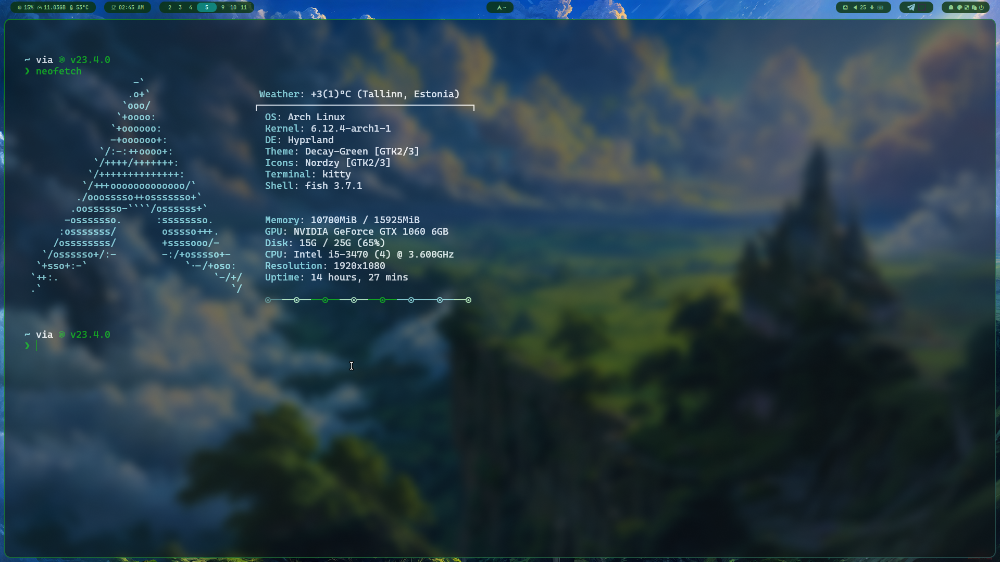

  
  
  
   
  
  

  
  - *Shell:* [Fish](https://github.com/fish-shell/fish-shell)
  - *Terminal Emulator:* [Kitty](https://github.com/kovidgoyal/kitty) 
  - *System Info Tool:* [Neofetch](https://github.com/dylanaraps/neofetch)
  - *Font:* [Caskadiya Cove](https://github.com/eliheuer/caskaydia-cove)

  
  
  

